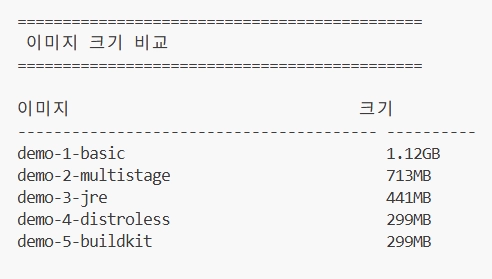
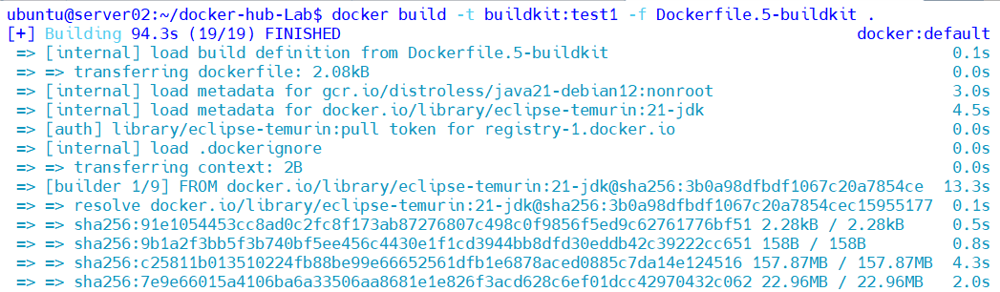
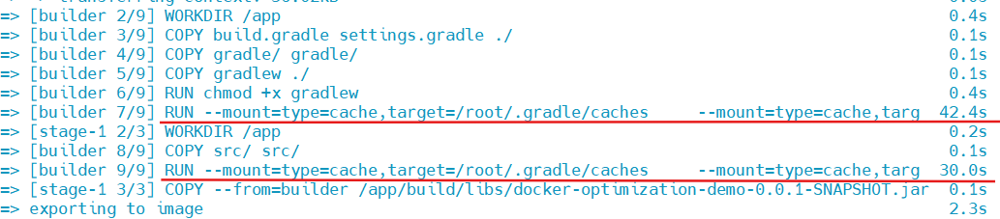
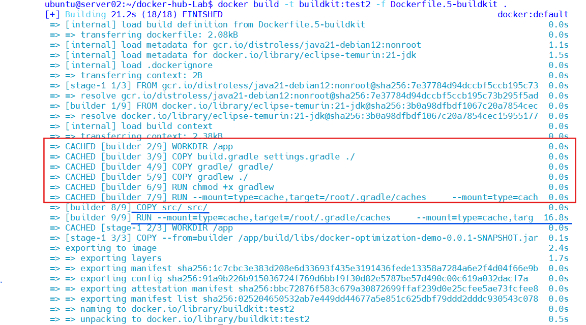
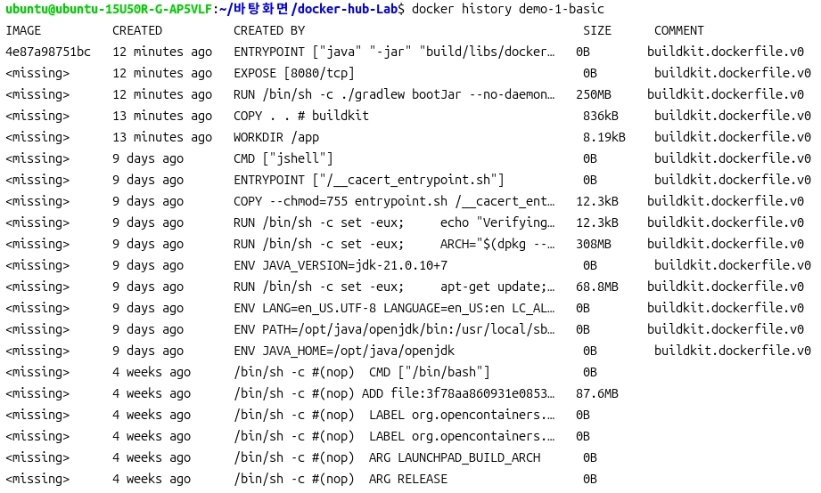
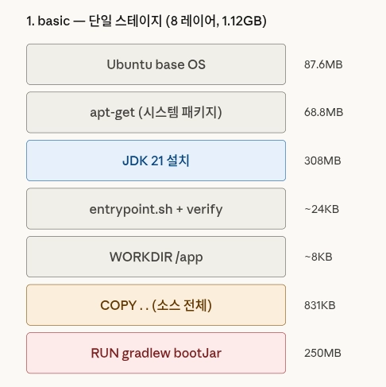
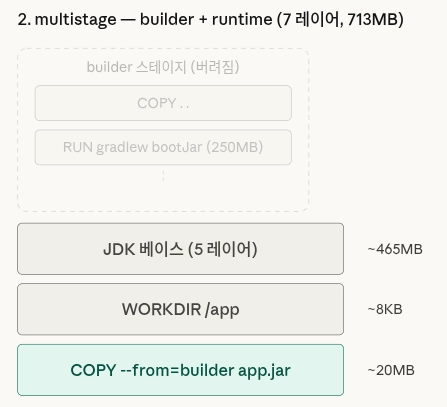
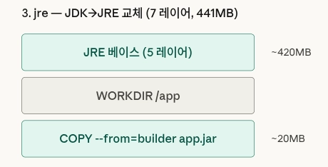
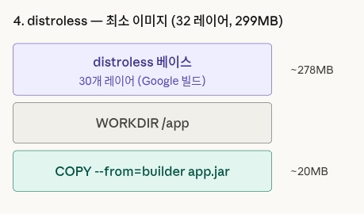
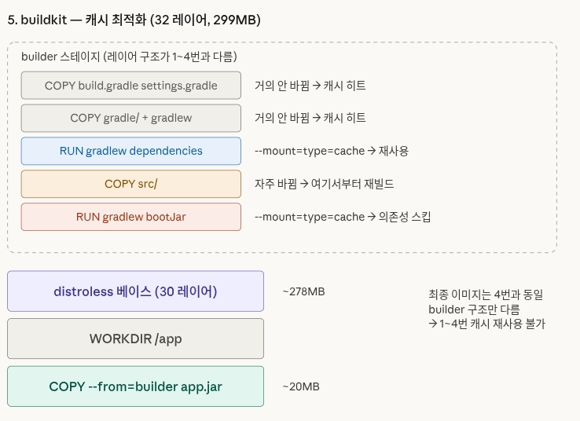

# 📈 Docker 이미지 최적화 전략 비교 및 검증

Spring Boot REST API 앱을 기반으로, Docker 이미지 최적화 단계를 5가지 Dockerfile로 비교합니다.

## 📂 프로젝트 구조

```
docker-optimization-demo/
├── src/main/java/com/example/demo/
│   ├── DemoApplication.java
│   └── controller/
│       └── HelloController.java
├── src/main/resources/
│   └── application.properties
├── build.gradle
├── settings.gradle
├── .dockerignore
├── Dockerfile.1-basic          # 기본형: JDK 단일 스테이지
├── Dockerfile.2-multistage     # 멀티스테이지: builder + runtime 분리
├── Dockerfile.3-jre            # JRE 경량화: JRE slim 교체
├── Dockerfile.4-distroless     # distroless: 운영 최소 이미지
├── Dockerfile.5-buildkit       # BuildKit 캐시: 빌드 속도 최적화
├── build-all.sh                # 전체 빌드 & 비교 스크립트
└── README.md
```
<br/>

## ✨ 단계별 최적화 결과 요약

| 단계 | Dockerfile | 핵심 변경 | 이미지 크기 | 감소율 |
|------|------------|-----------|-----------|--------|
| 1 | basic | JDK & 실행 파일 | 1.12GB | - |
| 2 | multistage | builder/runtime 분리, 빌드 산출물만 복사 | 713MB | 36% |
| 3 | jre | 런타임을 JDK에서 JRE로 교체 | 441MB | 60% |
| 4 | distroless | 셸/패키지매니저 없는 최소 이미지 | 299MB | 74% |
| 5 | buildkit | 4단계 & Gradle 캐시 마운트로 빌드 속도 개선 | 299MB | 74% |

<br/>


## 🛠️ 초기 세팅

프로젝트에는 실행 파일이 포함되어 있지 않습니다.
로컬에 Gradle을 아래 명령어로 설치하세요.

```bash
sudo snap install gradle --classic
gradle wrapper --gradle-version 8.10
```

<br/>

## ⚙️ 도커 파일 빌드 

### 전체 빌드 & 비교
```bash
chmod +x build-all.sh
./build-all.sh
```

### 개별 빌드
```bash
# 기본형
docker build -f Dockerfile.1-basic -t demo-1-basic .

# 멀티스테이지
docker build -f Dockerfile.2-multistage -t demo-2-multistage .

# JRE 경량화
docker build -f Dockerfile.3-jre -t demo-3-jre .

# distroless
docker build -f Dockerfile.4-distroless -t demo-4-distroless .

# BuildKit 캐시 (BuildKit 필수)
DOCKER_BUILDKIT=1 docker build -f Dockerfile.5-buildkit -t demo-5-buildkit .
```

---

## 📊 빌드 결과 및 성능 비교

### 1. 이미지 크기
최종 단계인 Distroless 적용 시, 기본형 대비 **약 74%의 용량을 절감**했습니다.



| 이미지 명 | 태그 | 크기 | 감소율(1번 대비) | 비고 |
|:---|:---|:---|:---:|:---|
| `demo-1-basic` | `demo-1-basic` | **1.12GB** | - | 기준점 (Full JDK) |
| `demo-2-multistage` | `demo-2-multistage` | **713MB** | ⬇️ 36% | 빌드 도구/소스 제거 |
| `demo-3-jre` | `demo-3-jre` | **441MB** | ⬇️ 60% | JRE 실행 환경 교체 |
| `demo-4-distroless` | `demo-4-distroless` | **299MB** | ⬇️ 74% | 최소 운영 이미지 |
| `demo-5-buildkit` | `demo-5-buildkit` | **299MB** | ⬇️ 74% | 4번과 동일 |

### 2. 빌드 속도
소스 코드 수정 후 **재빌드** 시, BuildKit 캐시 마운트 유무에 따른 속도 차이가 극명하게 나타납니다.

### 2-1. 초기 빌드

<p align="left">
  
  
</p>

- 캐시 마운트 과정이 필요

### 2-2. 코드 수정 후 재빌드

<p align="left">
  
</p>

- 빨간 박스는 일반 Docker 레이어 캐시로 재사용된 단계이고, 파란 줄은 수정된 소스가 다시 반영되는 지점이다.
- 소스 변경 이후 단계는 다시 실행되지만, BuildKit은 이때도 Gradle 캐시를 활용해 의존성 준비 비용을 줄여 재빌드 시간을 더 단축한다.


| 빌드 방식 | 최초 빌드 (Cold) | 소스 수정 후 재빌드 (Hot) | 핵심 차이 |
|:---:|:---:|:---:|:---|
| **일반 멀티스테이지 (2~4번)** | 약 90s | **약 90s+** | 소스 수정 시 캐시가 깨져 의존성을 다시 다운로드함 |
| **BuildKit 캐시형 (5번)** | 약 90s | **약 27s** | 의존성 레이어를 보존하여 **실제 컴파일만 수행** |

---

## ⚖️ 각 단계별 트레이드오프

### 1. 기본형
- **장점**: 단순함, 디버깅 편리 (JDK 도구 모두 사용 가능)
- **단점**: 이미지 크기 최대, 소스코드/빌드캐시 노출

### 2. 멀티스테이지
- **장점**: 소스코드 제거, 빌드 도구 분리
- **단점**: Dockerfile 복잡도 약간 증가

### 3. JRE 경량화
- **장점**: 컴파일러/개발도구 제거로 크기 감소
- **단점**: jmap, jstack 등 JDK 진단 도구 사용 불가

### 4. distroless
- **장점**: 최소 공격 표면, 비root 기본 실행, glibc 호환
- **단점**: 셸 없음 → docker exec 디버깅 불가, 환경변수 치환 불가

### 5. BuildKit 캐시
- **장점**: 재빌드 시 의존성 다운로드 스킵, 빌드 시간 대폭 단축
- **단점**: BuildKit 필수, 로컬/CI 캐시 설정 필요

---

## 🔍 심층 분석: 레이어 및 이미지 구조 (Deep Dive)
`docker inspect`와 `docker history`를 통해 각 이미지의 내부 구조를 분석한 결과입니다.

### 1. 이미지별 레이어 수 비교
```bash
for img in demo-1-basic demo-2-multistage demo-3-jre demo-4-distroless demo-5-buildkit; do
count=$(docker inspect $img --format '{{len .RootFS.Layers}}')
echo "$img: ${count}개 레이어"
done
```

**결과**
| 이미지 명 | 레이어 수 | 구조 분석 (Filesystem Layers) |
|:---|:---:|:---|
| `demo-1-basic` | **8개** | 베이스(5) + WORKDIR(1) + COPY(1) + RUN(1) |
| `demo-2-multistage` | **7개** | 베이스(5) + WORKDIR(1) + COPY --from(1) |
| `demo-3-jre` | **7개** | 베이스(5) + WORKDIR(1) + COPY --from(1) |
| `demo-4-distroless` | **32개** | Distroless 베이스(31) + COPY --from(1) |
| `demo-5-buildkit` | **32개** | 4번과 동일 |

> 💡 1번과 2번의 레이어 1개 차이는 `RUN ./gradlew bootJar` 레이어의 유무입니다. 멀티스테이지는 **수백 MB에 달하는 빌드 과정 레이어를 최종 이미지에서 제거**합니다.

---
### 2. 레이어별 상세 (어디에서 용량을 차지하는지 확인)

```bash
docker history demo-1-basic
docker history demo-5-buildkit
```

<p align="left">
  
</p>

`docker history` 실행 시 나타나는 `<missing>` 은 **캐시로 활용되는 레이어**입니다.

- **`<missing>`은 데이터 부재가 아니다**: 베이스 이미지(`eclipse-temurin`)를 build한 주체가 생성한 레이어들입니다. 로컬 빌드 환경에서는 해당 레이어를 만든 중간 이미지 ID를 알 수 없을 뿐, 실제 파일시스템 데이터는 로컬에 존재하며 캐시로 재사용됩니다.
- **레이어 수 ≠ history 항목 수**: `ENV`, `CMD`, `EXPOSE`, `ENTRYPOINT` 등 메타데이터 명령은 이미지 설정만 바꿀 뿐 실제 파일시스템 레이어를 생성하지 않습니다(Size가 0B로 표시됨). 따라서 `docker inspect`가 카운트하는 실제 레이어 수와 차이가 발생합니다.

---

### 3. 멀티스테이지 빌드의 동작 원리

<p align="center">
  
  
</p>

```bash
FROM eclipse-temurin:21-jdk AS builder    # 빌드용 (버려짐)
FROM eclipse-temurin:21-jdk               # 런타임용 (이게 남음)
```
Dockerfile 내에 여러 개의 `FROM` 절이 존재하더라도, 도커는 **마지막 `FROM` 절부터 시작하는 스테이지만을 최종 이미지로 빌드**합니다.

<p align="center">
  
  
</p>

```bash
# 빌드 스테이지 — eclipse-temurin:21-jdk (셸 있음)
FROM eclipse-temurin:21-jdk AS builder
WORKDIR /app
COPY . .
RUN ./gradlew bootJar --no-daemon     # 셸이 있으니까 RUN 가능

# 런타임 스테이지 — distroless (셸 없음)
FROM gcr.io/distroless/java21-debian12:nonroot
WORKDIR /app
COPY --from=builder ...jar app.jar    # 파일 복사일 뿐, 셸 불필요
ENTRYPOINT ["java", "-jar", "app.jar"] # exec form, 셸 불필요
```



---

## 💡 주요 분석 포인트

### 🔍 왜 5번(BuildKit) 방식이 가장 효율적인가?
1. **레이어 분리 전략**  
   `build.gradle`, `settings.gradle`, `gradle/`, `gradlew`를 먼저 복사하고, 소스 코드는 마지막에 복사하도록 구성했습니다.  
   이 구조 덕분에 `src`만 수정된 경우 의존성 관련 레이어가 무효화되지 않고 그대로 재사용됩니다.

2. **Gradle 캐시 재사용**  
   `--mount=type=cache`를 통해 `/root/.gradle/caches`, `/root/.gradle/wrapper`를 빌드 간 공유하도록 구성했습니다.  
   그 결과 이미 다운로드한 라이브러리와 Wrapper 관련 파일을 다시 받지 않아도 되므로, 반복 빌드 시 불필요한 작업을 줄일 수 있습니다.

3. **네트워크 비용 절감**  
   소스 코드만 수정된 재빌드에서 20초대 결과가 나온 이유는, 수백 MB 규모의 외부 라이브러리를 다시 다운로드하지 않았기 때문입니다.  
   이는 로컬 개발 환경뿐 아니라 CI/CD 환경에서도 빌드 및 배포 시간을 줄이는 데 중요한 요소입니다.

4. **개발 루프 최적화**  
   BuildKit 방식은 첫 배포를 위한 최적화보다, 코드 수정 → 이미지 재생성 → 실행이 반복되는 개발 루프를 더 빠르게 만드는 데 강점이 있습니다.  
   실제로 첫 빌드 94.3초, 수정 없는 재빌드 2.1초, 소스 수정 후 재빌드 21.2초로 차이가 분명하게 나타났습니다.


### 🔍 Distroless 채택의 의미

- **최소 크기**: Shell이나 패키지 매니저처럼 실행에 필요 없는 요소를 제외해서 최종 이미지 크기를 299MB까지 줄였다.
- **보안 측면**: 기본으로 들어있는 도구가 적어서 컨테이너 내부에서 불필요하게 노출되는 부분이 줄고, 그만큼 공격 표면도 작아진다.
